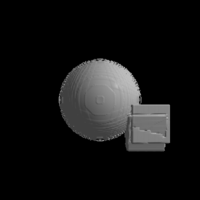

---
# Feel free to add content and custom Front Matter to this file.
# To modify the layout, see https://jekyllrb.com/docs/themes/#overriding-theme-defaults

layout: home
---

<h2>Projects</h2>
* [3D scanner](https://github.com/intel/depthcamera-3d-model-web-demo) -
  Detect the movement of a depth camera without any motion sensor and create
  a 3D model out of it.

    
* [Depth camera point cloud](https://github.com/01org/depthcamera-pointcloud-web-demo) -
  Demo on how to view the data from a depth camera in WebGL.
    
* [NSim](https://github.com/mkollaro/nsim) - physics simulator of the Solar
  system (or any other) with both CSV and OpenGL output
* [DestroyStack](https://github.com/mkollaro/destroystack) - Fault injection
   tests for OpenStack
* [LaunchpadStats](https://github.com/mkollaro/launchpadstats) - create tables out
  of launchpad statistics (e.g how many commits each user has)
* [Taskrunner](https://github.com/mkollaro/taskrunner) - very simple executor of
  Python scripts, made to replace a more complicated tool
* [C snippets](https://github.com/mkollaro/c_snippets) - experiments and
  exercises in C
* [OpenGL snippets](https://github.com/mkollaro/opengl_snippets) - experiments and
  reproducers for OpenGL bugs

